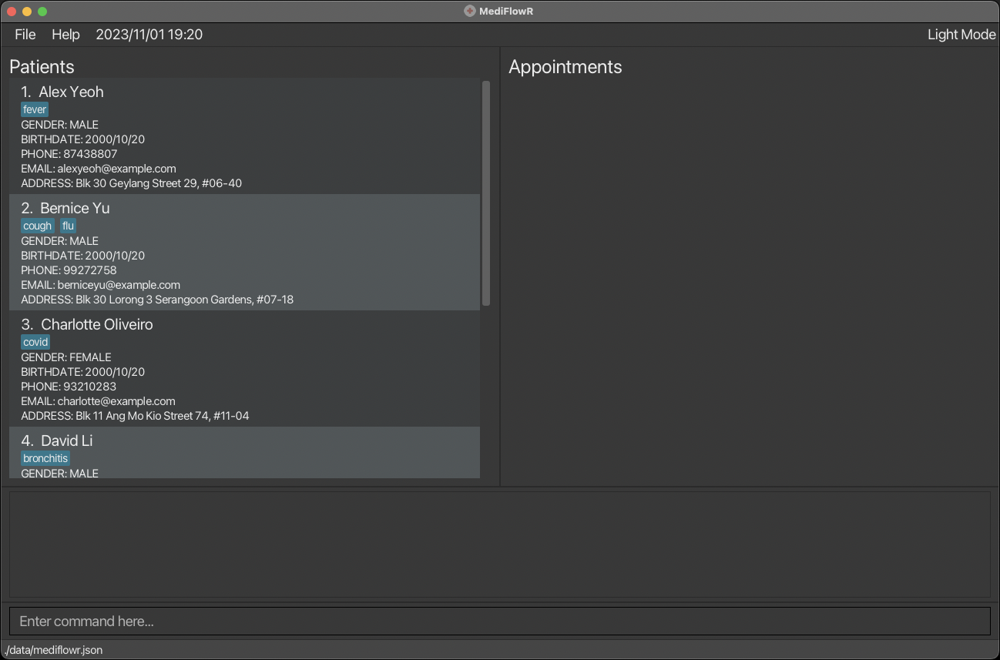
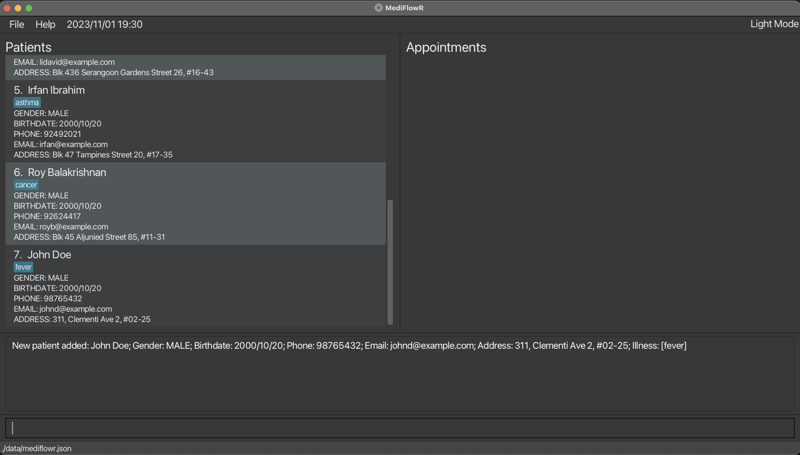
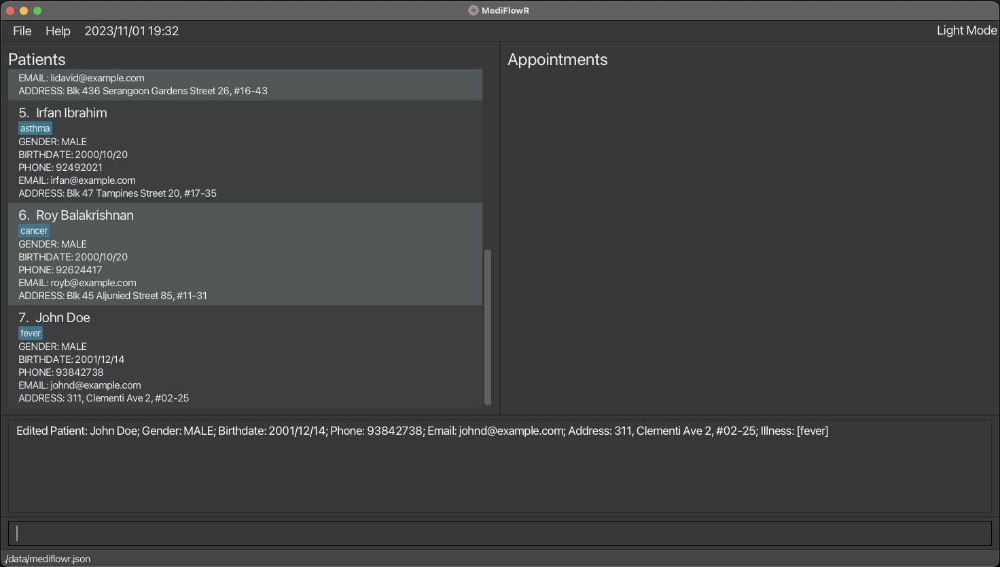
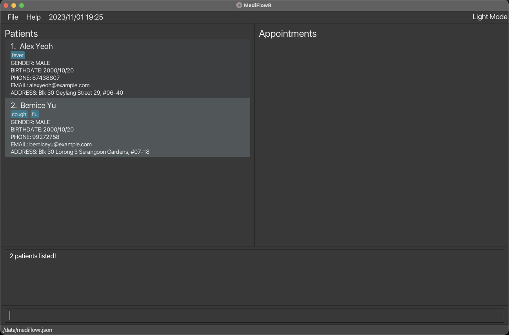
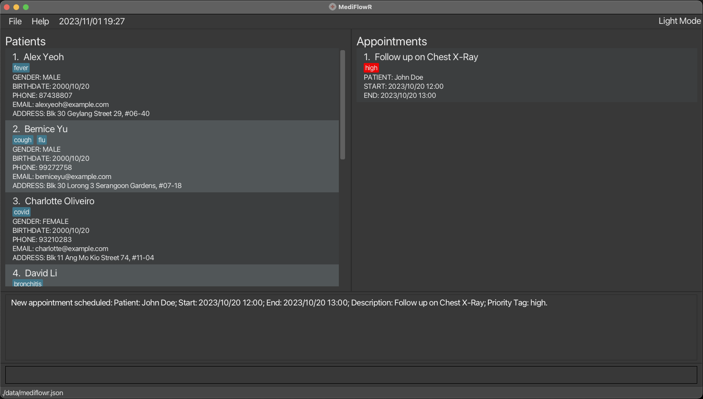

# MediFlowR

## Welcome to MediFlowR

Too many patients to handle? Mixing up your patient appointments?

Don't worry, we got you! Taking control of your patient records management is now made easier with **MediFlowR**, and
this user guide will help you master the application in no time!

### About MediFlowR:

MediFlowR is a desktop application built for medical practitioners to manage their day-to-day operations. It is a
user-friendly and efficient patient records management system designed to help you streamline your patient management
processes. In the fast-paced world of healthcare, we understand the importance of keeping patient information organised
and appointments on track. MediFlowR is your solution!

### Key Features:
To simplify your administrative tasks, our application provides a range of features, but not limited to:

1. **Patient Information Management:** Easily store, access and edit patient data, making it simple to track patient's vital information and history.
2. **Appointment Scheduling:** Efficiently manage patient appointments and eliminate the risk of scheduling conflicting appointments.
3. **Integration:** Seamlessly integrate patient records across multiple departments by allowing users to update patient information, allowing for the doctor to follow up and ensuring continuity of care.

Here at MediFlowR, we believe in keeping things simple and efficient.

_**Simple:**_
Navigating MediFlowR is a breeze. Our intuitive user interface just displays essential information allowing
you to quickly access the information you need. Moreover, this user guide together with the in-application guidance
minimises the learning curve for your administrative staff.

_**Efficient:**_
On top of these functionalities, we believe that patient management must be efficient.
Therefore, MediFlowR is optimised for keyboard users. By simply typing, MediFlowR can get your
hospital management tasks done faster than the other apps in the industry.

--------------------------------------------------------------------------------------------------------------------

## Table of Contents

- [Glossary](#glossary)

- [Navigating the application](#navigating-the-application)

- [Quick Start](#quick-start)

- [Tutorial for new users](#tutorial-for-new-users)

- [Features](#features)

    - [Patient Commands](#patient-commands)

        - [Adding a new patient: `add`](#adding-a-new-patient-add)

        - [Updating a patient's details: `edit`](#updating-a-patients-details-edit)
     
        - [Diagnosing a patient: `diagnose`](#diagnosing-a-patient-diagnose)
     
        - [Undiagnosing a patient: `undiagnose`](#undiagnosing-a-patient-undiagnose)

        - [Removing a patient: `delete`](#removing-a-patient-delete)

        - [Displaying all patients: `patients`](#displaying-all-patients-patients)

        - [Finding patients by name: `find-p`](#finding-patients-by-name-find-p)

        - [Finding patients by illness: `find-i`](#finding-patients-by-illness-find-i)
      
        - [Sorting patients: `sort-p`](#sorting-patients-sort-p)

    - [Appointment Commands](#appointment-commands)

        - [Scheduling a new appointment: `schedule`](#scheduling-a-new-appointment-schedule)

        - [Rescheduling an appointment: `reschedule`](#rescheduling-an-appointment-reschedule)

        - [Triaging an appointment: `triage`](#triaging-an-appointment-triage)

        - [Cancelling an appointment: `cancel`](#cancelling-an-appointment-cancel)

        - [Displaying all appointments: `appointments`](#displaying-all-appointments-appointments)

        - [Finding appointments by patient name: `find-a`](#finding-appointments-by-patient-name-find-a)
     
        - [Displaying all appointments for today: `today`](#displaying-all-appointments-for-today-today)

        - [Displaying all upcoming appointments: `upcoming`](#displaying-all-upcoming-appointments-upcoming)

        - [Sorting appointments: `sort-a`](#sorting-appointments-sort-a)

    - [Miscellaneous Commands](#miscellaneous-commands)

        - [Displaying all patient records and appointments: `list`](#displaying-all-patient-records-and-appointments-list)

        - [Undoing a previous command: `undo`](#undoing-a-previous-command-undo)

        - [Redoing a previous command: `redo`](#redoing-a-previous-command-redo)

        - [Clearing all records: `clear`](#clearing-all-records-clear)

        - [Toggling dark/light mode: `mode`](#toggling-darklight-mode-mode)

        - [Exiting the program: `exit`](#exiting-the-program-exit)

        - [Viewing help: `help`](#viewing-help-help)

- [Commands summary](#commands-summary)

- [FAQ](#faq)

- [Known Issues](#known-issues)

:bulb: **Tip:**
If you are using a PDF version of this document, be careful when copying and pasting commands that span multiple lines as the format might be different when copied over to the application.

--------------------------------------------------------------------------------------------------------------------

## Glossary

Here are **some common terms** that you might encounter throughout the user guide:

| Term      | Meaning                                                                            |
|-----------|------------------------------------------------------------------------------------|
| Command   | The instruction that you enter into the application                                |
| Parameter | The additional information provided when you enter a command                       |
| Attribute | The particular information of the patient/appointment you want to access           |
| Index     | The position a patient/appointment is at on the patients records/appointments list |

Here are **some common icons** that you might see throughout the user guide:

| Icons                     | Meaning                                                                       |
|---------------------------|-------------------------------------------------------------------------------|
| :clipboard: **Format**    | Provides you with the format used for a command                               |
| :paperclip: **Example**   | Provides you with an example on how to use a command                          |
| :pencil2: **Notes**       | Provides you with some additional information on the inputs for a command     |
| :bulb: **Tip**            | Provides you with small tips to improve your experience using the application |
| :exclamation: **Warning** | Warns you on the potential dangers of not using a command properly            |

Here are **some common formats** that you need to follow when entering commands:

| Format                            | Meaning                                                                                     |
|-----------------------------------|---------------------------------------------------------------------------------------------|
| `WORDS_IN_CAPITAL_LETTERS`        | The parameters of a command                                                                 |
| `[Words between square brackets]` | The parameters that are not necessary for the command to run (i.e. the optional parameters) |

Return to the [Table of Contents](#table-of-contents)

--------------------------------------------------------------------------------------------------------------------

## Navigating the application

| Name              | Function                                         |
|-------------------|--------------------------------------------------|
| Patients List     | Displays patient records                         |
| Appointments List | Displays appointments that are scheduled         |
| Status Box        | Displays the results after a command is executed |
| Command Box       | For you to enter the commands                    |

Return to the [Table of Contents](#table-of-contents)

--------------------------------------------------------------------------------------------------------------------

## Quick start

1. Ensure you have Java `11` or above installed in your Computer.

    - To check your Java version, open Command Prompt if you are on Windows, or Terminal if you are on MacOS, and run `java --version`. If you do not have Java installed, you can install it [here](https://www.oracle.com/java/technologies/downloads/#java11).

2. Download the latest `mediflowr.jar` from [here](https://github.com/AY2324S1-CS2103T-T08-4/tp/releases).

3. Create a folder in the location where you want the application to stay in, and copy the file into that folder.

    - This is necessary as the application will create additional files to store settings and the data itself, so this will nicely organise the files.

4. If you are familiar with _Command Prompt on Windows_ or _Terminal on MacOS_, navigate to the folder that you have just created using `cd` command and open the application using the `java -jar mediflowr.jar` command.

    - If you are not familiar, follow the instructions listed [here](#faq).

5. You should now be able to use the application.

    - If you wish to familiarise yourself with the application, you can follow the **tutorial** on how to use MediFlowR in the next section [here](#tutorial-for-new-users).

    - If you wish to learn more in depth about the **different features**, you can skip forward to this section [here](#features).

Return to the [Table of Contents](#table-of-contents)

--------------------------------------------------------------------------------------------------------------------

## Tutorial for new users

If this is your first time using MediFlowR, do not worry as this is a tutorial for you to get familiar with the features
of MediFlowR. Please follow the instructions [here](#quick-start) first to set up the application before proceeding with the tutorial.

- Launch the MediFlowR application. If you are not able to launch the application, follow the instructions [here](#faq). You will see the screen as shown above.

  - Note: When the application is first launched, it will contain some default patient records.

- Let us try **adding a patient** into our patient records. Enter the command `add name=John Doe gender=MALE birthdate=2000/10/20 phone=98765432 email=johnd@example.com address=311, Clementi Ave 2, #02-25 illnesses=Fever` in the command box.

- You should get this result screen. Scroll down in the patients list to confirm that patient _John Doe_ has indeed been added. Try adding a few more patients into the patient records with the same format to familiarise yourself with the command.

- Let us try **editing a patient** in our patient records. Enter the command `edit 7 birthdate=2001/12/14 phone=93842738` in the command box.

- You should get this result screen. Scroll down in the patients list to confirm that the birthdate and phone of patient _John Doe_ have indeed been edited. Try editing other attributes or editing other patients to familiarise yourself with the command.

- Let us try **finding a patient**. Enter the command `find-p alex bernice` in the command box.

- You should get this result screen. This command will find all patients with either the name `alex` or `bernice`.

- Let us try **scheduling an appointment** now that we have a patient in our records. Enter the command `schedule patient=John Doe start=2023/10/20 12:00 end=2023/10/20 13:00 description=Follow up on Chest X-Ray priority=high` in the command box.

- You should get this result screen. This will schedule a new appointment for the patient with the name `John Doe`. Try scheduling a few more appointments with the same format to familiarise yourself with the command.

- Let us try **rescheduling the appointment** that we have just scheduled. Enter the command `reschedule 1 start=2023/05/02 09:00 end=2023/05/02 11:00` in the command box.

- You should get this result screen. This will reschedule the appointment to start on `2023/05/02 09:00` and end on `2023/05/02 11:00`. Try rescheduling the appointment to other timings or rescheduling other appointments to familiarise yourself with the command.

- **Congratulations!** You have completed the tutorial. You are now ready to use MediFlowR. Enter the command `clear` to clear all patient records and appointments.
You can learn more about the different commands [here](#features).

Return to the [Table of Contents](#table-of-contents)

--------------------------------------------------------------------------------------------------------------------

## Features

MediFlowR provides a variety of commands for you to effectively manage your patient records and appointments. This section
will clearly guide you on how to use the commands so that you can streamline your workflow and take full advantage of the
features present in this application.

## Patient commands

### Adding a new patient: `add`

This command creates a new patient to be added to the patient records, along with the necessary personal information
and contact details about the patient.

:clipboard: **Format**: `add name=NAME gender=GENDER birthdate=BIRTHDATE phone=PHONE email=EMAIL address=ADDRESS [illnesses=ILLNESS]`

:paperclip: **Example**: `add name=John Doe gender=MALE birthdate=2000/10/20 phone=98765432 email=johnd@example.com address=311, Clementi Ave 2, #02-25 illnesses=fever`

The example command will add a _male_ patient called _John Doe_, with birthdate on _20 October 2000_, phone number at _98765432_,
email at _johnd@example.com_ and address at _311, Clementi Ave 2, #02-25_, who is currently down with _fever_.

:pencil2: **Notes:**

- A patient's name can only consist of _letters and numbers_.

- A patient's gender can only be `MALE` or `FEMALE`.

- A patient's birthdate must be in the format `yyyy/MM/dd`, e.g. `2001/04/28` for a birthdate on 28 April 2001.

- A patient's phone must be a _valid phone number_, i.e. only contains numbers.

- A patient's email must be a _valid email address_, i.e. of the form `name@domain.com`.

- You do not have to enter the illness when adding a patient.

:bulb: **Tip:**
You can enter more than one illness for a patient, e.g. `illnesses=fever, flu` will add both fever and flu as a patient's illnesses.

### Updating a patient's details: `edit`

This command updates a patient's personal information and contact details. It will update the details of the patient at
the specified `INDEX` shown in the patients records. You must edit *at least one* detail when using the command.

:clipboard: **Format**: `edit INDEX [name=NAME] [gender=GENDER] [birthdate=BIRTHDATE] [phone=PHONE] [email=EMAIL] [address=ADDRESS]`

:paperclip: **Example**: `edit 1 birthdate=2001/12/14 phone=93842738`

This example command will update the patient with index 1 in the patient records (i.e. the first patient) and will change
the patient's birthdate to _2001/12/14_ and phone number to _93842738_.

:pencil2: **Notes:**

- You must follow the same format as the [add patient command](#adding-a-new-patient-add) for the various details of the patient.

- The index provided must be a _positive integer_ and a _valid index_.

- You must edit _at least one_ detail when using the command.

### Diagnosing a patient: `diagnose`

This command adds one or more illnesses to a patient's current illnesses. It will update the details of the patient at
the specified `INDEX` shown in the patients records.

:clipboard: **Format**: `diagnose INDEX illnesses=ILLNESS`

:paperclip: **Example**: `diagnose 1 illnesses=fever`

:pencil2: **Notes:**

- The index provided must be a _positive integer_ and a _valid index_.

This example command will update the patient with index 1 in the patient records (i.e. the first patient) and will add
_fever_ to the patient's illnesses.

:bulb: **Tip:**
You can enter more than one illness for a patient, e.g. `illnesses=fever, flu` will add both fever and flu as a patient's illnesses.

### Undiagnosing a patient: `undiagnose`

This command removes one or more illnesses to a patient's current illnesses. It will update the details of the patient at
the specified `INDEX` shown in the patients records.

:clipboard: **Format**: `undiagnose INDEX illnesses=ILLNESS`

:paperclip: **Example**: `undiagnose 1 illnesses=fever`

:pencil2: **Notes:**

- The index provided must be a _positive integer_ and a _valid index_.

This example command will update the patient with index 1 in the patient records (i.e. the first patient) and will remove
_fever_ from the patient's illnesses.

:bulb: **Tip:**
You can enter more than one illness for a patient, e.g. `illnesses=fever, flu` will remove both fever and flu from a patient's illnesses.

### Removing a patient: `delete`

This commands removes the specified patient from the patient list. It will remove the patient at
the specified `INDEX` shown in the patients records.

:clipboard: **Format**: `delete INDEX`

:paperclip: **Example**: `delete 1`

This example command will remove the patient with index 1 in the patient records (i.e. the first patient).

:pencil2: **Notes:**

- The index provided must be a _positive integer_ and a _valid index_.

:exclamation: **Caution:**
If you delete a patient, all appointments for that patient will also be deleted.

### Displaying all patients: `patients`

This command shows a list of all patients currently recorded in the MediFlowR application under the patients section.

:clipboard: **Format**: `patients`

### Finding patients by name: `find-p`

This command finds patients whose names contain any of the keywords that you specified.

:clipboard: **Format**: `find-p NAME`

:paperclip: **Example**: `find-p alex david`

This example command will find all patients with names that contain either `alex` or `david`, e.g. `Alex Yeoh` and `David Li`.

:pencil2: **Notes:**

- The search is _case-insensitive_, meaning that finding patients with the keyword `John`
will return the same results as the keyword `john`.

- Only patients with names matching the _full words_ of the keywords will be displayed, meaning that `Tom` will find patients
with names that contain the full `Tom` but will not find patients
with names such as `Tommy`.

### Finding patients by illness: `find-i`

This command finds patients with illnesses that contain any of the keywords that you specified.

:clipboard: **Format**: `find-i ILLNESS`

:paperclip: **Example**: `find-i alex david`

This example command will find all patients with illnesses that contain either `fever` or `flu`.

:pencil2: **Notes:**

- The search is _case-insensitive_, meaning that finding illnesses with the keyword `fever`
  will return the same results as the keyword `Fever`.

- Only patients with names matching the _full words_ of the keywords will be displayed, meaning that `flu` will find patients
  with illnesses that contain the full `flu` but will not find patients
  with illnesses such as `influenza`.

### Sorting patients: `sort-p`

This command sorts the patients list by name or birthday, in ascending or descending order.

:clipboard: **Format**: `sort-p DIRECTION by=ATTRIBUTE`

:paperclip: **Example**: `sort-p asc by=name`

This example command will sort the patients by the _names_ in _ascending order_.

:pencil2: **Notes:**

- This command will sort all patients in the application, but it will only display the patients that are currently displayed.
  E.g. If you had just used the command `find-p` to find patients by name, this command will only display
  the patients that were found by the previous command.

- The direction can only be `asc` or `desc`, i.e. ascending or descending order respectively.

- The attribute to sort the patients by can only be `name` or `birthday`.

## Appointment Commands

### Scheduling a new appointment: `schedule`

This command schedules an appointment for an existing patient in the patient records. It will schedule an appointment
for the patient with the name `PATIENT`.

:clipboard: **Format**: `schedule patient=PATIENT start=START end=END description=DESCRIPTION priority=PRIORITY`

:paperclip: **Example**: `schedule patient=Alex Yeoh start=2023/10/20 12:00 end=2023/10/20 13:00 description=Follow up on Chest X-Ray priority=high`

This example command will schedule a new _high priority_ appointment for the patient _Alex Yeoh_ on _20 October 2023_
from _12pm_ to _1pm_ for his _follow-up appointment on his chest X-Ray_.

:pencil2: **Notes:**

- The patient provided for an appointment must be the _full name_ of a patient that is already in the patient records.

- An appointment start and end must be in the format `yyyy/MM/dd HH:mm`, e.g. `2023/04/28 19:00` for 28 April 2023, at 7pm.

- An appointment start date time should occur _before_ end date time of the same appointment.

- An appointment description can only consist of _letters and numbers_.

- An appointment priority can only be `high`, `medium`, or `low`.

### Rescheduling an appointment: `reschedule`

This command reschedules an existing appointment to another timeslot. It will reschedule the appointment at the specified
`INDEX` shown in the appointments list.

:clipboard: **Format**: `reschedule INDEX start=START end=END`

:paperclip: **Example**: `reschedule 1 start=2023/05/02 09:00 end=2023/05/02 11:00`

This example command will reschedule the appointment with index 1 in the appointments list (i.e. the first appointment) to
_2 May 2023_, from _9am_ to _11am_.

:pencil2: **Notes:**

- You must follow the same format as the [schedule appointment command](#scheduling-a-new-appointment-schedule) for the various details of the appointment.

- The index provided must be a _positive integer_ and a _valid index_.

- You must specify _both start and end_ when using the command.

### Triaging an appointment: `triage`

This command changes the priority of an existing appointment. It will change the appointment at the specified
`INDEX` shown in the appointments list.

:clipboard: **Format**: `triage INDEX priority=PRIORITY`

:paperclip: **Example**: `triage 1 priority=high`

This example command will change the priority of the appointment with index 1 in the appointments list (i.e. the first appointment) to _high_.

:pencil2: **Notes:**

- The index provided must be a _positive integer_ and a _valid index_.

- An appointment priority can only be `high`, `medium`, or `low`.

### Cancelling an appointment: `cancel`

This command cancels an existing appointment. It will cancel the appointment at the specified
`INDEX` shown in the appointments list.

:clipboard: **Format**: `cancel INDEX`

:paperclip: **Example**: `cancel 1`

This example command will cancel the appointment with index 1 in the appointments list (i.e. the first appointment).

:pencil2: **Notes:**

- The index provided must be a _positive integer_ and a _valid index_.

### Displaying all appointments: `appointments`

This command shows a list of all appointments currently scheduled.

:clipboard: **Format**: `appointments`

### Finding appointments by patient name: `find-a`

This command finds appointments with patient names that contain any of the keywords that you specified.

:clipboard: **Format**: `find-a PATIENT`

:paperclip: **Example**: `find-a alex david`

This example command will find all appointments with patient names that contain either `alex` or `david`, e.g. `Alex Yeoh` or `David Li`.

:pencil2: **Notes:**

- The search is _case-insensitive_, meaning that finding appointments with the keyword `John`
  will return the same results as the keyword `john`.

- Only appointments with patient names matching the _full words_ of the keywords will be displayed, meaning that `Tom` will find patients
  with names that contain the full `Tom` but will not find patients
  with names such as `Tommy`.

### Displaying all appointments for today: `today`

This command shows a list of all appointments currently scheduled to start today, i.e. the current date you are using
the command on.

:clipboard: **Format**: `today`

### Displaying all upcoming appointments: `upcoming`

This command shows a list of all upcoming appointments currently scheduled.

:clipboard: **Format**: `upcoming`

### Sorting appointments: `sort-a`

This command sorts the appointments list by date or priority, in ascending or descending order.

:clipboard: **Format**: `sort-a DIRECTION by=ATTRIBUTE`

:paperclip: **Example**: `sort-a asc by=time`

This example command will sort the appointments by the _times_ in _ascending order_.

:pencil2: **Notes:**

- This command will sort all appointments in the application, but it will only display the appointments that are currently displayed.
E.g. If you had just used the command `find-a` to find appointments by patient name, this command will only display
the appointments that were found by the previous command.

- The direction can only be `asc` or `desc`, i.e. ascending or descending order respectively.

- The attribute to sort the appointments by can only be `time` or `priority`.

## Miscellaneous commands

### Displaying all patient records and appointments: `list`

This command displays all patient records and appointments.

:clipboard: **Format**: `list`

### Undoing a previous command: `undo`

This command undoes a previous command.

:clipboard: **Format**: `undo`

### Redoing a previous command: `redo`

This command redoes a previous command that you undid.

:clipboard: **Format**: `redo`

### Clearing all records: `clear`

This command clears all patient records and appointments from the application.

:clipboard: **Format**: `clear`

### Toggling dark/light mode: `mode`

This command toggles the dark/light mode for the application.

:clipboard: **Format**: `mode`

### Exiting the program: `exit`

This command exits the program.

:clipboard: **Format**: `exit`

### Viewing help: `help`

Shows a message explaining how to access the help page.

:clipboard: **Format**: `help`

Return to the [Table of Contents](#table-of-contents)

--------------------------------------------------------------------------------------------------------------------

## Commands summary

| Action                                                                                                       | Format, Examples                                                                                                                                                                                                                                                       |
|--------------------------------------------------------------------------------------------------------------|------------------------------------------------------------------------------------------------------------------------------------------------------------------------------------------------------------------------------------------------------------------------|
| [**Adding a new patient**](#adding-a-new-patient-add)                                                        | `add name=NAME gender=GENDER birthdate=BIRTHDATE phone=PHONE email=EMAIL address=ADDRESS [illness=ILLNESS]`   e.g., `add name=John Doe gender=MALE birthdate=2000/10/20 phone=98765432 email=johnd@example.com address=311, Clementi Ave 2, #02-25 illnesses=fever` |
| [**Updating a patient's details**](#updating-a-patients-details-edit)                                        | `edit INDEX [name=NAME] [gender=GENDER] [birthdate=BIRTHDATE] [phone=PHONE] [email=EMAIL] [address=ADDRESS]`   e.g., `edit 1 birthdate=2001/12/14 phone=93842738`                                                                                                   |
| [**Diagnosing a patient**](#diagnosing-a-patient-diagnose)                                                   | `diagnose INDEX illnesses=ILLNESS`  e.g., `diagnose 1 illnesses=fever`                                                                                                                                                                                              |
| [**Undiagnosing a patient**](#undiagnosing-a-patient-undiagnose)                                             | `undiagnose INDEX illnesses=ILLNESS`  e.g., `undiagnose 1 illnesses=fever`                                                                                                                                                                                          |
| [**Removing a patient**](#removing-a-patient-delete)                                                         | `delete INDEX`  e.g., `delete 1`                                                                                                                                                                                                                                    |
| [**Displaying all patients**](#displaying-all-patients-patients)                                             | `patients`                                                                                                                                                                                                                                                             |
| [**Finding patients by name**](#finding-patients-by-name-find-p)                                             | `find-p NAME`  e.g., `find-p alex david`                                                                                                                                                                                                                            |
| [**Finding patients by illness**](#finding-patients-by-illness-find-i)                                       | `find-i ILLNESS`  e.g., `find-i fever flu`                                                                                                                                                                                                                          |
| [**Sorting patients**](#sorting-patients-sort-p)                                                             | `sort-p DIRECTION by=ATTRIBUTE`  e.g., `sort-p asc by=name`                                                                                                                                                                                                         |
| [**Scheduling a new appointment**](#scheduling-a-new-appointment-schedule)                                   | `schedule patient=PATIENT start=START end=END description=DESCRIPTION priority=PRIORITY`   e.g., `schedule patient=Alex Yeoh start=2023/10/20 12:00 end=2023/10/20 13:00 description=Follow up on Chest X-Ray priority=high`                                        |
| [**Rescheduling an appointment**](#rescheduling-an-appointment-reschedule)                                   | `reschedule INDEX start=START end=END`  e.g., `reschedule 1 start=2023/05/02 09:00 end=2023/05/02 11:00`                                                                                                                                                            |
| [**Triaging an appointment**](#triaging-an-appointment-triage)                                               | `triage INDEX priority=PRIORITY`  e.g., `triage 1 priority=high`                                                                                                                                                                                                    |
| [**Cancelling an appointment**](#cancelling-an-appointment-cancel)                                           | `cancel INDEX`  e.g., `cancel 1`                                                                                                                                                                                                                                    |
| [**Displaying all appointments**](#displaying-all-appointments-appointments)                                 | `appointments`                                                                                                                                                                                                                                                         |
| [**Finding appointments by patient name**](#finding-appointments-by-patient-name-find-a)                     | `find-a PATIENT`  e.g., `find-a alex david`                                                                                                                                                                                                                         |
| [**Displaying all appointments for today**](#displaying-all-appointments-for-today-today)                    | `today`                                                                                                                                                                                                                                                                |
| [**Displaying all upcoming appointments**](#displaying-all-upcoming-appointments-upcoming)                   | `upcoming`                                                                                                                                                                                                                                                             |
| [**Sorting appointments**](#sorting-appointments-sort-a)                                                     | `sort-a DIRECTION by=ATTRIBUTE`  e.g., `sort-a asc by=time`                                                                                                                                                                                                         |
| [**Displaying all patient records and appointments**](#displaying-all-patient-records-and-appointments-list) | `list`                                                                                                                                                                                                                                                                 |
| [**Undoing a previous command**](#undoing-a-previous-command-undo)                                           | `undo`                                                                                                                                                                                                                                                                 |
| [**Redoing a previous command**](#redoing-a-previous-command-redo)                                           | `redo`                                                                                                                                                                                                                                                                 |
| [**Clearing all patient records**](#clearing-all-patient-records-clear)                                      | `clear`                                                                                                                                                                                                                                                                |
| [**Toggling dark/light mode**](#toggling-darklight-mode-mode)                                                | `mode`                                                                                                                                                                                                                                                                 |
| [**Exiting the program**](#exiting-the-program-exit)                                                         | `exit`                                                                                                                                                                                                                                                                 |
| [**Viewing help**](#viewing-help-help)                                                                       | `help`                                                                                                                                                                                                                                                                 |

Return to the [Table of Contents](#table-of-contents)

--------------------------------------------------------------------------------------------------------------------

## FAQ

**Q**: How do I launch the MediFlowR application? 
**A**: The easiest way is to double-click the `mediflowr.jar` file and the application should launch. If that does not work,
follow the steps here:
1. Open Command Prompt if you are on Windows, or open Terminal if you are on MacOS.
2. Navigate to the directory that contains the `mediflowr.jar` file using the `cd` command. For example, if the file is
located at `C:\Users\YourUserName\Downloads` on Windows or `~/Downloads` on MacOS, you can enter the command `cd C:\Users\YourUserName\Downloads`
or `cd ~/Downloads` to navigate to that directory.
3. Open the `mediflowr.jar` file using the command `java -jar mediflowr.jar`. The application should launch afterwards.

**Q**: How do I transfer my data to another Computer? 
**A**: You can install MediFlowR on that other computer, then simply transfer over the `mediflowr.json` file located in the
data folder to the data folder on that other computer. The data folder is located at the same place as your MediFlowR application.

**Q**: How do I save my data after any changes I have made? 
**A**: The data is saved automatically after any command that changes the data. There is no need to save manually.

**Q** Can I edit the data file used by the application directly? 
**A**: MediFlowR data are saved automatically as a JSON file `[JAR file location]/data/mediflowr.json`. Advanced users are welcome to update data directly by editing that data file.

:exclamation: **Caution:**
If your changes to the data file makes its format invalid, the application will discard all data and start with an empty data file at the next run. Hence, it is recommended to take a backup of the file before editing it.

Return to the [Table of Contents](#table-of-contents)

--------------------------------------------------------------------------------------------------------------------

## Known issues

1. **When using multiple screens**, if you move the application to a secondary screen, and later switch to using only the primary screen, the application will open off-screen. The remedy is to delete the `preferences.json` file created by the application, located in the same folder as the application, before running the application again.

Return to the [Table of Contents](#table-of-contents)
